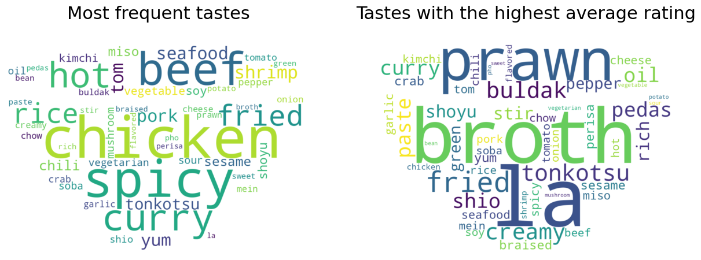
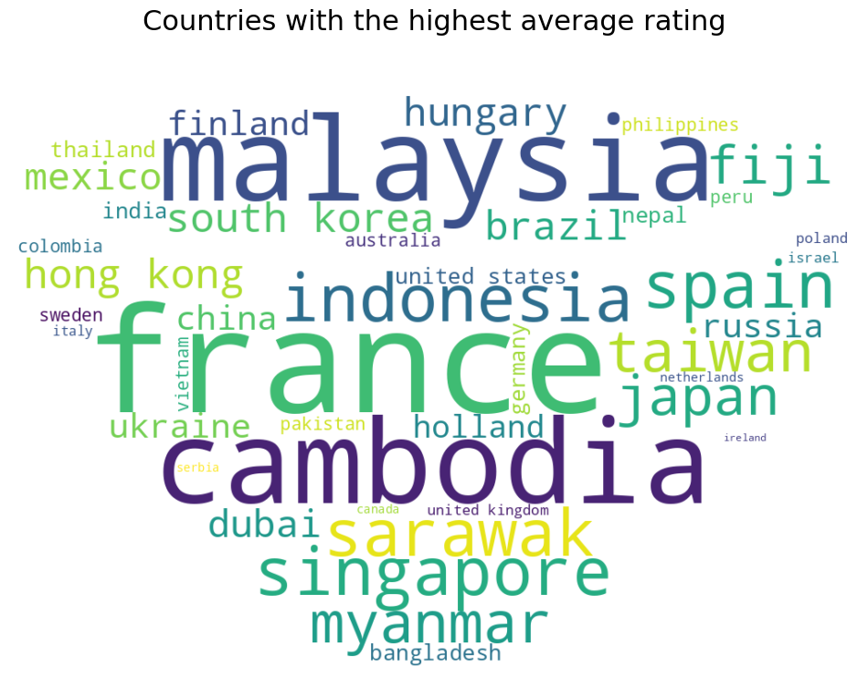
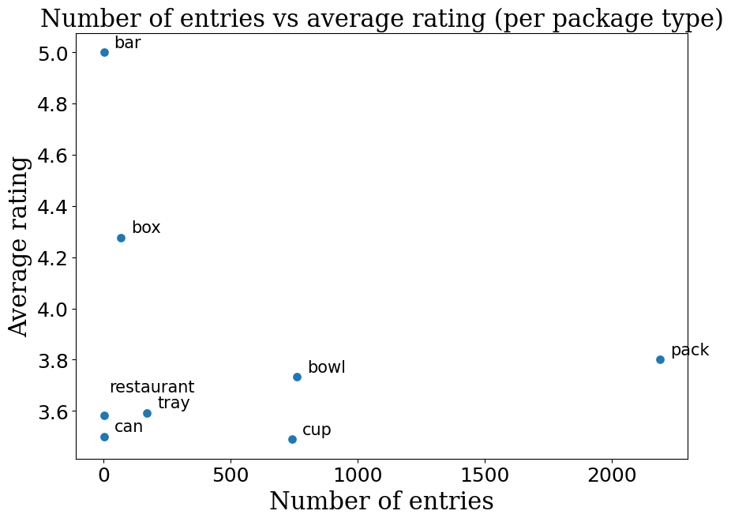

# Ramen-Ratings-Project
This is a project made in collaboration with Anastasia Ludwig during the Introduction to Data Science -course. The project aimed to analyse the dataset created by the [Ramen Rater](https://www.theramenrater.com/resources-2/the-list/). By the time of doing this project, he had tasted, rated and documented almost 4000 different types of ramen, their country of origin, brand, flavour descriptions and packaging style. We especially wanted to find out if there were any connections between the origin country, flavour, brand and the ramen rating.

The code is presented as a jupyter notebook file. In the section "Plotting tastes" there is an interactive widget that diplayes a WordCloud of best-rated tastes for any selected country. The data needed to run the code is provided in the repository. The newer version of the "Big List" can be found on the Ramen Rater's [website](https://www.theramenrater.com/resources-2/the-list/).

*A wordcloud depicting the most frequently appearing tastes (on the left) and highest rated tastes (on the right).*

*A wordcloud depicting the countries with the highest rated ramen. The bigger the word, the higher the average rating that country's ramen had.*

## Code Purpose

This Python code loads, preprocesses, analyses and performs linear regression on the data to find dependencies between variables.

### Data Used:
- **The Big List**: Provided by the Ramen Rater on his [website](https://www.theramenrater.com/resources-2/the-list/) *(publicly available)*.

### Workflow:
1. **Data Loading and initial data cleaning**
2. **Plotting the data to see the dependencies**
3. **Preprocessing further the "Variety" column to standardize the flavours**
4. **Plotting taste dependencies**
5. **Encoding categorical variabled**
6. **Performing linear regression**

*Average rating of a package type per number of entries.*

## Requirements

To run this code, you will need the following Python libraries:
- `pandas`
- `numpy`
- `scikit-learn`
- `SciPy`
- `PyTorch`
- `matplotlib`
- `seaborn`
- `PIL`
- `wordcloud`
- `seaborn`
- `IPython.display`
- `ipywidgets`
